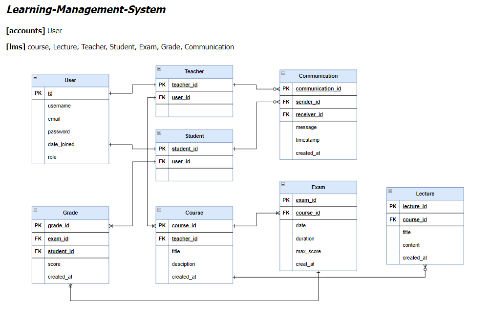

`작성자 : 조나희` `framework : Django`

[API 명세서](https://documenter.getpostman.com/view/28126206/2sA358eRYN#f109a018-fadf-40cd-8d59-d80e89b89ffe)

[NOTION](https://thunder-twister-d63.notion.site/LMS-REST-API-8326f8895de5437fa2f94e8ed38b2315?pvs=4)

  

# 2024 learning-management-system

 

### 목표

- LMS(Learning Management System)을 위한 data model을 설계해보자.
- LMS을 위한 REST API를 만들어 보자.

### 요구 사항

- 다음 팀장의 이야기를 참고하여 LMS에 대해 자유롭게 설계한다.
- ERD를 만든다.
- 간단한 API 문서를 작성한다.
    - Postman or notion 활용(또는 Swagger)

  

>   **팀장 ALEX :**
>
> 
>   우리는 학생들의 성적을 관리하기 위한 LMS를 만들거야
>
> 
>   과목은 시범적으로 국어, 영어, 수학만 사용할 것이지만 추후에 다른 과목들도 추가할거야
>
> 
>   우리 서비스에는 강사들이 있어. 강사들은 담당 교과목이 존재하고, 교과목마다 여러 개의 강의를 진행할거야
>
>
>   학생들은 그 강의들을 수강하고, 시험을 본 후 LMS상에서 점수를 확인할 수 있어

   

# 내용 요약 : LMS 시스템 API 구축
 

- **학생 성적 관리 LMS**
- 국어, 영어, 수학
- 과목마다 담당 교사 존재
- 교과목마다 여러 개의 강의 진행
- 학생들은 그 강의를 수강한다.
- 시험을 본 후에는 LMS에서 점수 확인이 가능하다.

   

# 최종 주제 : 학생/교사 온라인 교육 플랫폼

>   학생들과 교사들이 온라인으로 교육을 제공하고 수강하는 플랫폼

 

### [LMS 기능]

1. **로그인**
    1. 사용자는 아이디와 비밀번호를 사용하여 로그인할 수 있다.
    2. 로그인이 성공하면 학생 또는 교사로 인식되어 해당 권한에 맞는 기능을 이용할 수 있다
    3. 사용자는 인증된 토큰을 통해 회원 탈퇴를 할 수 있다.
2. **다양한 교과목 및 강의 제공**
    1. 국어, 영어, 수학 등 다양한 교과목이 제공
    2. 각 과목은 여러 강의로 구성되어 있으며, 교사들이 강의를 준비하고 제공
3. **학생 및 교사 등록**
    1. 학생과 교사는 서비스에 등록하여 강의를 제공하거나 수강할 수 있다.
    2. 등록된 사용자는 개인 정보를 관리하고 강의를 검색하거나 생성할 수 있다.
4. **강의 관리 기능**
    1. 교사는 강의를 만들고 관리할 수 있다.
    2. 강의 내용, 자료, 과제 및 시험을 추가하고 수정할 수 있다. 
    3. 교사는 강의 일정을 설정하여 학생들에게 공지하고 관리할 수 있다.
5. **수강 기능**
    1. 학생들은 등록된 강의를 검색하여 수강할 수 있다. 
    2. 강의에 대한 정보를 확인하고 수강신청을 할 수 있다.
6. **시험 및 성적 관리**
    1. 시험 결과는 학생 및 교사에게 제공되며
    2. 성적은 서비스를 통해 확인할 수 있다.
7. **커뮤니케이션 기능**
    1. 학생과 교사 간의 소통을 위한 기능이 제공(message)
    2. 학생은 강의에 대한 질문을 할 수 있고, 교사는 학생들에게 피드백을 제공할 수 있습니다.

   

# Entity-Relationship Diagram (ERD)

 

### **[accounts]**

1. **사용자 (User)**
    - `id`: 각 사용자의 고유 식별자
    - `username`: 사용자 이름
    - `email`: 사용자 이메일 주소
    - `password`: 사용자 비밀번호 (해시로 저장될 예정)
    - `date_joined`: 사용자 등록일
    - `role`: 사용자 역할 (학생 또는 교사)

 

### **[lms]**

1. **과목 (Course)**
    - `course_id`: 각 과목의 고유 식별자
    - `title`: 과목명
    - `description`: 과목에 대한 설명
    - `teacher_id`: 해당 과목의 담당 교사를 식별하기 위한 외래 키 (교사 엔티티와의 다대일 관계)
    - `created_at`: 과목 생성일
2. **강의 (Lecture)**
    - `lecture_id`: 각 강의의 고유 식별자
    - `title`: 강의 제목
    - `content`: 강의 내용
    - `course_id`: 해당 강의가 속한 과목을 식별하기 위한 외래 키 (과목 엔티티와의 다대일 관계)
    - `created_at`: 강의 생성일
3. **교사 (Teacher)**
    - `teacher_id`: 각 교사의 고유 식별자
    - `user_id`: 교사와 연결된 사용자를 식별하기 위한 외래 키 (User 테이블과의 일대일 관계)
4. **학생 (Student)**
    - `student_id`: 각 학생의 고유 식별자
    - `user_id`: 학생과 연결된 사용자를 식별하기 위한 외래 키 (User 테이블과의 일대일 관계)
5. **시험 (Exam)**
    - `exam_id`: 각 시험의 고유 식별자
    - `course_id`: 시험이 속한 과목을 식별하기 위한 외래 키 (과목 엔티티와의 다대일 관계)
    - `date`: 시험 일자
    - `duration`: 시험 시간
    - `max_score`: 시험 최고 점수
    - `created_at`: 시험 생성일
6. **성적 (Grade)**
    - `grade_id`: 각 성적의 고유 식별자
    - `exam_id`: 성적이 부여된 시험을 식별하기 위한 외래 키 (시험 엔티티와의 다대일 관계)
    - `student_id`: 성적을 받은 학생을 식별하기 위한 외래 키 (학생 엔티티와의 다대일 관계)
    - `score`: 학생이 받은 점수
    - `created_at`: 성적 입력일
7. **커뮤니케이션 (Communication)**
    - `communication_id`: 각 커뮤니케이션의 고유 식별자
    - `sender_id`: 메시지를 보낸 사용자를 식별하기 위한 외래 키 (학생 또는 교사)
    - `receiver_id`: 메시지를 받는 사용자를 식별하기 위한 외래 키 (학생 또는 교사)
    - `message`: 메시지 내용
    - `timestamp`: 메시지 전송 시간
    - `created_at`: 메시지 발신일

 

### **[관계 설명]**

- **사용자**와 **교사 및** **학생** 엔티티는 일대일 관계를 가진다.
- 사용자가 로그인하면, 사용자의 **역할**에 따라 학생 또는 교사로 인식됩니다.
- **각 과목**은 **하나의 교사**에 의해 담당되며, **하나의 교사**는 여러 개의 과목을 가질 수 있다.
- **하나의 과목**은 **여러 개의 강의**로 구성될 수 있으며, 각 강의는 **하나의 과목**에만 속할 수 있습니다.
- 학생은 **여러 번의 시험**을 볼 수 있으며, **한 번의 시험**에는 **여러 명의 학생**이 참여할 수 있습니다.
- **한 시험에 대한 성적**은 **여러 학생**에게 부여될 수 있으며, **한 학생**은 **여러 시험**에 참여할 수 있습니다.
- 학생과 교사 간의 커뮤니케이션은 **양방향**으로 이루어지며, **한 명의 학생**이 **여러 번의 메시지**를 보낼 수 있고, **한 명의 교사**가 **여러 명의 학생에게 메시지**를 보낼 수 있습니다.

   